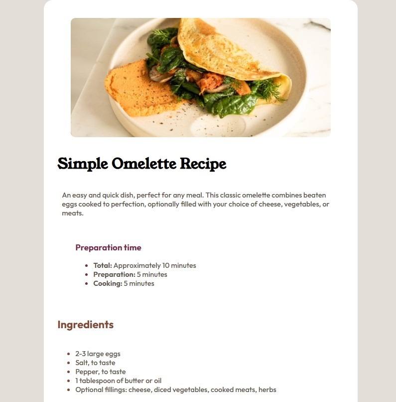

## screenshot



## Table of contents

- [Overview](#overview)
  - [The challenge](#the-challenge)
- [My process](#my-process)
  - [Built with](#built-with)
  - [What I learned](#what-i-learned)
- [Author](#author)
- [Acknowledgments](#acknowledgments)

**Note: Delete this note and update the table of contents based on what sections you keep.**

## Overview
This project is a responsive recipe web page showcasing a simple omelette recipe. It is designed as a clean, beginner-friendly static site, emphasizing semantic HTML structure and modern CSS styling. It includes clear sections for ingredients, instructions, nutrition facts, and preparation time — all presented in an elegant, easy-to-read layout.

This project was inspired by a Frontend Mentor challenge and focuses on building practical HTML and CSS skills while experimenting with component-based structuring and reusable custom classes.

## The Challenge
Creating and styling tables: I initially struggled with table syntax and styling because I hadn’t worked with them much before. Thanks to W3Schools documentation, I learned how to style rows, columns, and borders effectively.

Image alignment: Ensuring the recipe image stayed centered and didn't overflow its block on smaller screens took some extra experimentation and adjustments.


## My process
Fully responsive layout using semantic HTML5 elements

Clean, aesthetic design with custom colors and typography

Informative and structured sections: Ingredients, Instructions, Nutrition

Custom-styled table showcasing nutritional information

Interactive links with hover effects

Clear usage of custom CSS classes for easier maintenance and styling flexibility

### Built with

HTML5 — for semantic structure

CSS3 — custom styles, layout handling, and hover effects

Custom utility classes — to make styling individual elements easier and more reusable

Acknowledgments to W3Schools for their helpful content on tables


### What I learned

How to create and style HTML tables, including borders, padding, and hover interactions

Handling images in layouts, especially preventing them from overflowing their container when resizing

The importance of custom utility classes to simplify targeted styling

Better understanding of semantic HTML elements (e.g., <section>, <article>, <footer>, headings)
To see how you can add code snippets, see below:

```html
<h1>Some HTML code I'm proud of</h1>
```
```css
.proud-of-this-css {
  color: papayawhip;
}
```
```js
const proudOfThisFunc = () => {
  console.log('🎉')
}
```


### Useful resources

- [Example resource 1](https://www.example.com) - This helped me for XYZ reason. I really liked this pattern and will use it going forward.
- [Example resource 2](https://www.example.com) - This is an amazing article which helped me finally understand XYZ. I'd recommend it to anyone still learning this concept.

## Author

- Website - [jeff20501]
- Frontend Mentor - [@jeff20501](https://https://www.frontendmentor.io/profile/jeff20501)
- Twitter - [@jeff20501](https://www.twitter.com/yourusername)

## Acknowledgments

Challenge by Frontend Mentor

Additional learning resources from W3Schools


## Getting started
Clone or download the repository.

Open the index.html file in your browser.

Explore and enjoy the recipe page!
